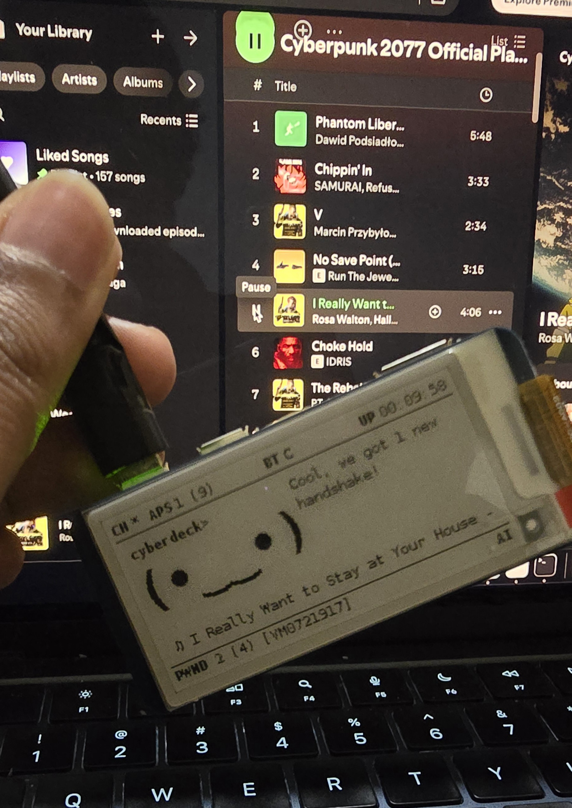

# 🎵 PwnSpotify Plugin for Pwnagotchi

Turn your Pwnagotchi into a music companion! Display your currently playing Spotify tracks with a sleek scrolling animation. Now your Pwnagotchi listens to your playlist 🎧


```
    ┌──────────────────┐
    │    ⊙    ⊙       │
    │      ▼          │
    │  ♫ Bohemian... >│
    └──────────────────┘
```

## 🎬 Demo

[Watch the YouTube Shorts video](https://youtube.com/shorts/euAg2Y6unZc?si=wvN4OWWJeb4soVpa)

## ✨ Features

- 🔄 Real-time display of currently playing Spotify tracks
- 📱 Smooth scrolling text animation
- 🎯 Configurable display position and scroll speed
- 🔁 Automatic token refresh
- 💪 Robust error handling and reconnection
- 🎨 Clean and minimal UI integration

## ✨ Upcoming Features

- Control songs directly via your pwnagotchi.
- More animations.
- Pwnagotchi react to the songs!

## 📋 Prerequisites

- Pwnagotchi with display
- Active Spotify account
- Spotify Developer Access
- Internet connectivity for your Pwnagotchi

## 🚀 Installation

1. Copy the `pwnspotify.py` file to your Pwnagotchi plugins directory:
```
Figure it our yourself mate!
```

## 🎯 Spotify API Setup

1. Visit the [Spotify Developer Dashboard](https://developer.spotify.com/dashboard) 🌐
2. Click `Create an App`
3. Fill in the application details:
   - Name: `Pwnagotchi Spotify`
   - Description: `Spotify integration for Pwnagotchi`
   - Website: (optional)
   - Redirect URI: `http://localhost:8080`

4. After creating the app, you'll get:
   - ⭐ Client ID
   - 🔑 Client Secret

5. Generate your authorization code:
   - Replace `YOUR_CLIENT_ID` in this URL and open it in your browser:
   ```
   https://accounts.spotify.com/authorize?client_id=YOUR_CLIENT_ID&response_type=code&redirect_uri=http://localhost:8080&scope=user-read-currently-playing
   ```
   - Log in and authorize the application
   - You'll be redirected to localhost:8080
   - Copy the `code` parameter from the URL (everything after `code=`)

## ⚙️ Configuration

Add these lines to your `/etc/pwnagotchi/config.toml`:

```toml
main.plugins.pwnspotify.enabled = true
main.plugins.pwnspotify.client_id = "YOUR_CLIENT_ID"
main.plugins.pwnspotify.client_secret = "YOUR_CLIENT_SECRET"
main.plugins.pwnspotify.redirect_uri = "http://localhost:8080"
main.plugins.pwnspotify.auth_code = "YOUR_AUTH_CODE"
```

### 🛠️ Optional Settings

```toml
main.plugins.pwnspotify.scroll_speed = 2          # Text scroll speed
main.plugins.pwnspotify.check_interval = 30       # How often to check for new tracks (seconds)
main.plugins.pwnspotify.retry_interval = 5        # Connection retry interval (seconds)
main.plugins.pwnspotify.display_position = [180, 100]  # Screen position [x, y]
main.plugins.pwnspotify.display_width = 12        # Number of characters to show
main.plugins.pwnspotify.static_display_time = 3   # Full text display duration (seconds)
main.plugins.pwnspotify.token_file = "/root/.spotify_tokens"  # Token storage location
```

## 🎮 Usage

1. Restart your Pwnagotchi after configuration:
```bash
systemctl restart pwnagotchi
```

2. The plugin will automatically:
   - 🔄 Connect to Spotify
   - 💾 Handle token management
   - 📱 Display your currently playing track

## 🔍 Display Format

- Playing: `♫ Track Name - Artist`
- No track: `No track playing`
- Connecting: `Connecting to Spotify...`

## 🐛 Troubleshooting

1. **No Display**
   - Check if plugin is enabled in config
   - Verify Spotify credentials
   - Check Pwnagotchi logs: `journalctl -u pwnagotchi -f`

2. **Authorization Failed**
   - Generate new auth code
   - Verify client ID and secret
   - Check redirect URI in Spotify dashboard

3. **Token Issues**
   - Delete `/root/.spotify_tokens`
   - Restart Pwnagotchi
   - Plugin will generate new tokens

## 🤝 Contributing

Feel free to:
- 🐛 Report bugs
- 💡 Suggest features
- 🔧 Submit pull requests

## 📄 License

This project is licensed under MIT.

Made with ❤️ for the Pwnagotchi community